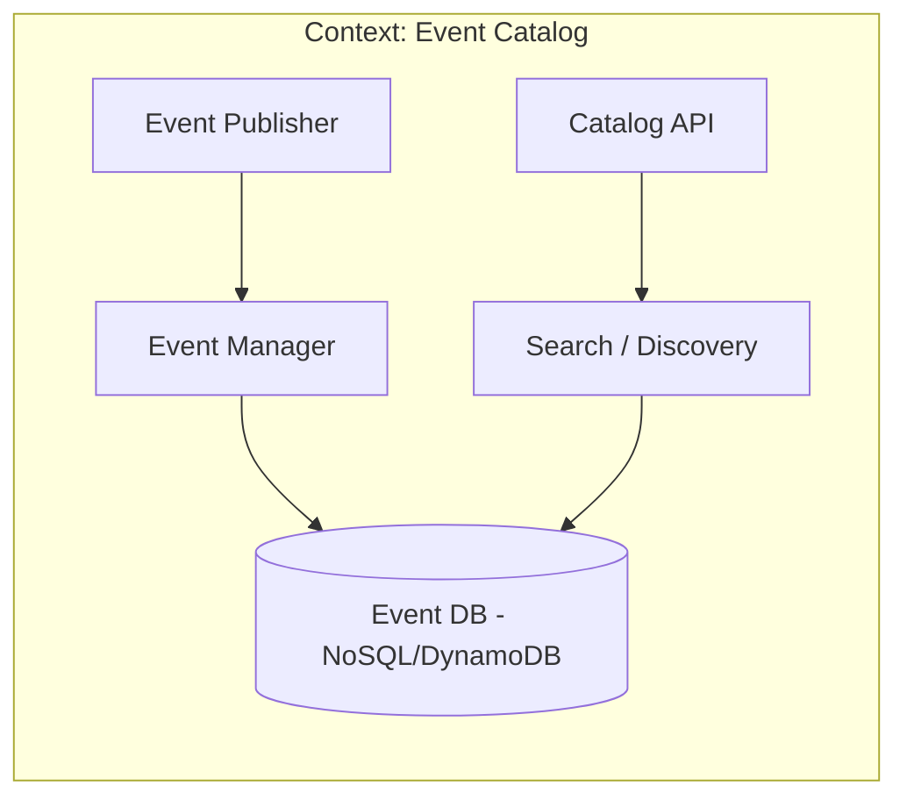
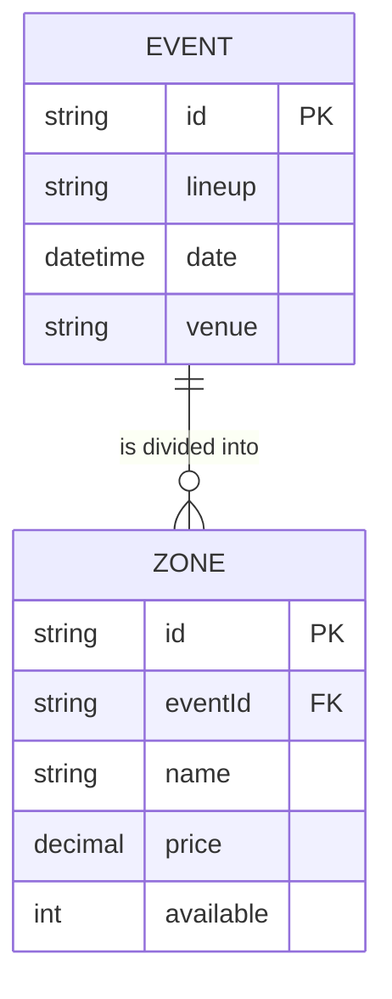
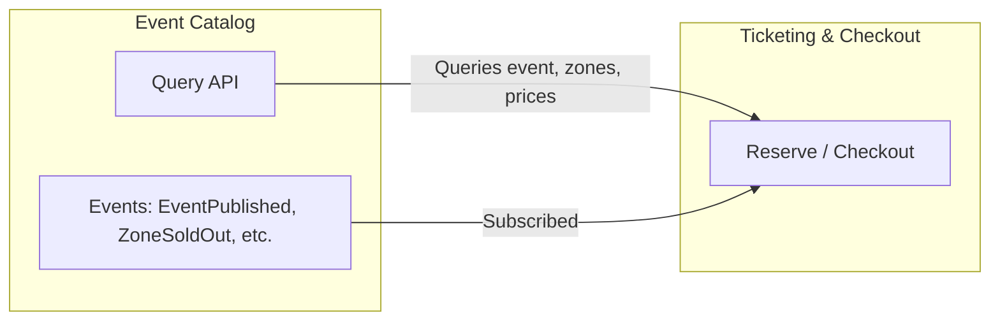
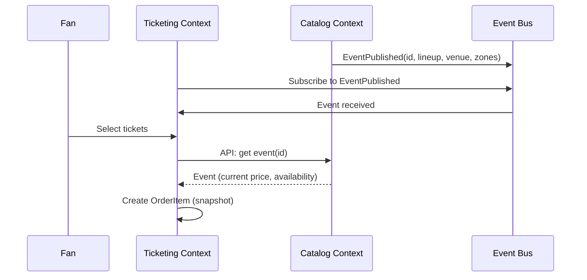

# Bounded Context: Event Catalog

## Table of Contents
- [Description](#description)
- [Responsibilities](#responsibilities)
- [Ubiquitous Language](#ubiquitous-language)
- [Domain Model](#domain-model)
- [Events](#events)
- [Diagrams](#diagrams)

---

## Description
The **Event Catalog** manages discovery. It is the search engine where fans see which artists are playing, at which venues, and when. It knows nothing about payment gateways or gate validation. It easily handles everything from a 45 minute  set to a massive festival.

## Responsibilities
- Manage **Events** (Tours, Festivals, Concerts).
- Manage **Venues** (Stadiums, Theaters) and their capacities.
- Expose **Zones/Tiers** (VIP, General Admission) and base prices.
- Maintain global capacity inventory.

## Ubiquitous Language
| Term | Meaning in this context |
| :--- | :--- |
| **Event** | The show (like Rise Against, Offspring, and Sublime at Allianz Parque) |
| **Venue** | The physical location and its seating map |
| **Zone** | Capacity grouping (like South Stand, VIP Pit) |

## Domain Model

### Main Entity: Event
```text
Event {
  id,
  lineup: ["Offspring", "Sublime", "Rise Against"],
  venueId,
  dateTime,
  zones: [ { name, price, totalCapacity, available } ]
}
```

### What this context DOES NOT know
- The credit card details.
- Whether a ticket's QR code has already been scanned at the gate.

---

## Events

### Emitted Events
| Event | Description | Typical Consumers |
| :--- | :--- | :--- |
| `EventPublished` | A new concert appears in the app | Ticketing |
| `ZoneSoldOut` | A specific tier no longer has available tickets | Notifications, UI |

### Consumed Events
| Event | Origin | Use in Catalog |
| :--- | :--- | :--- |
| `OrderPaid` | Ticketing | Permanently deduct from availability |
| `ReservationExpired` | Ticketing | Release tickets that were locked for 5 mins |

---

## Diagrams

### Internal Communication


### Aggregates and Entities

### Communication with other bounded contexts

The catalog **publishes events** and exposes **query APIs**. The other contexts use it as the source of truth for "what is happening and how much it costs."



|Aspect        |Detail                                                                 |
|--------------|-----------------------------------------------------------------------|
|Responsibility|Manage what is being sold (events, lineups, venues, zones, base prices)|
|Event         |Sellable entity with id, lineup, venue, date, and zone capacities      |
|Communication |Emits catalog change events; exposes query API for Ticketing           |
|Independence  |Does not depend on Ticketing or Access Control for its internal model  |