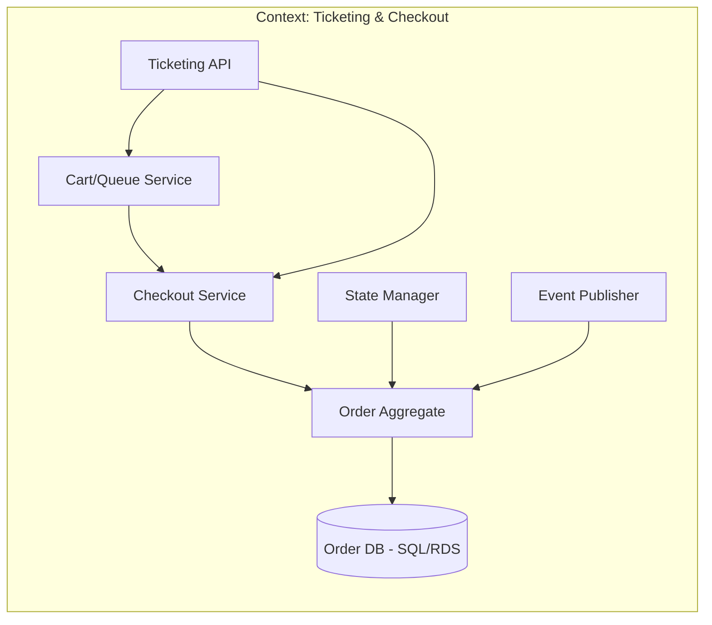
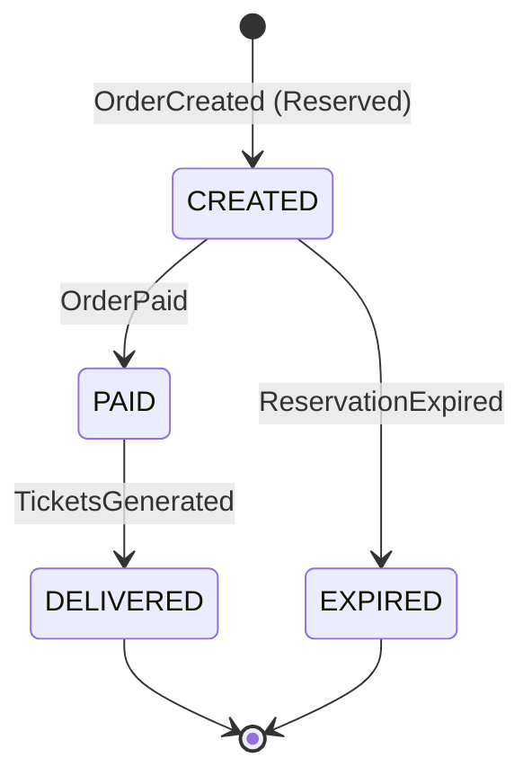
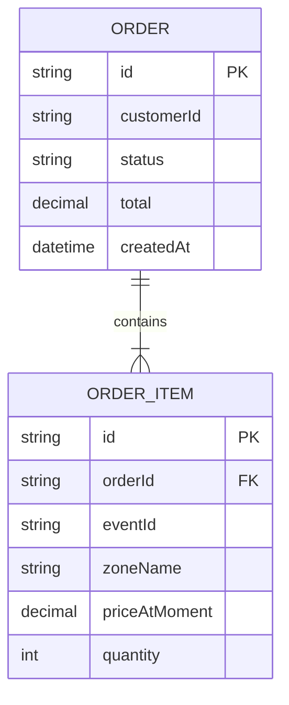
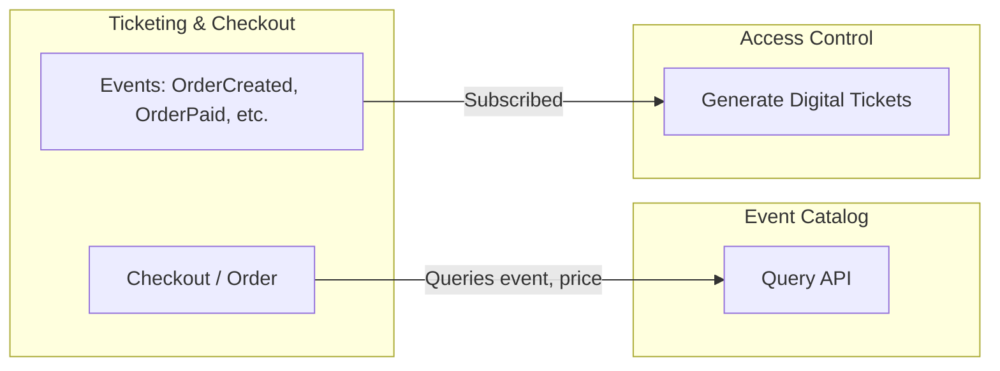
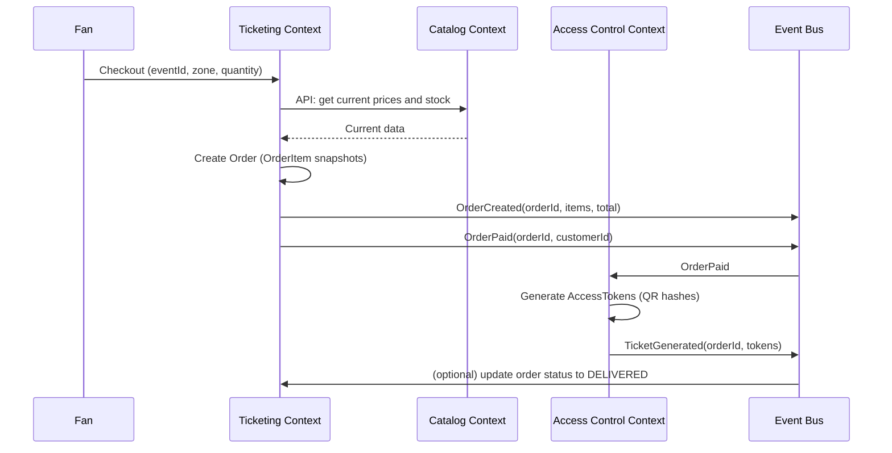

# Bounded Context: Ticketing & Checkout (Order Management)

## Table of Contents
- [Description](#description)
- [Responsibilities](#responsibilities)
- [Ubiquitous Language](#ubiquitous-language)
- [Domain Model](#domain-model)
- [Events](#events)
- [Diagrams](#diagrams)

---

## Description
The Ticketing context is the core for transactions. It manages high demand when a concert goes on sale. It temporarily holds tickets while the user pays and processes the financial transaction. A "ticket" here is a snapshot of price and quantity, not the entire catalog event.

## Responsibilities
- Manage the Virtual Queue for high-demand events.
- Temporarily lock inventory (5 minute Reservation).
- Integrate with payment gateways (Stripe, PayPal, CC, etc).
- Store the final Order (snapshot of the purchased price).

## Ubiquitous Language
| Term | Meaning in this context |
| :--- | :--- |
| **Reservation** | Temporary lock of a zone (expires in 5 min) |
| **Order** | The successful financial transaction |
| **Checkout** | Payment process |

## Domain Model

### Snapshot: OrderItem
In this context, a "ticket" is just a copy at the time of purchase:
```text
OrderItem {
  eventId,
  zoneName,
  priceAtMoment,
  quantity
}
```
The order saves the historical price even if the catalog changes it later.

### Typical Order States
| State | Description |
| :--- | :--- |
| **CREATED** | Order created, locked, pending payment |
| **PAID** | Payment confirmed |
| **DELIVERED** | QR codes generated by Access Control |
| **CANCELLED/EXPIRED** | User didn't pay in time |

---

## Events

### Emitted Events
| Event | Description | Typical Consumers |
| :--- | :--- | :--- |
| `ReservationExpired` | User failed to pay in time; lock released | Catalog |
| `OrderPaid` | Successful transaction; ticket belongs to fan | Access (Generates QR), Catalog |

### Consumed Events
Queries the Catalog in a synchronous way to validate current prices before locking the reservation.

---

## Diagrams

### Internal Communication


### State Flow


### Internal Data Model

### Communication with other bounded contexts

Ticketing consumes data from the Catalog (via API query) and publishes events that Access Control uses to generate the physical/digital passes.


### Sequence with events: from checkout to ticket generation

## Summary
|Aspect        |Detail                                                                 |
|--------------|-----------------------------------------------------------------------|
|Responsibility|Manage the intention to buy: reservations, orders, items, totals, financial states|
|Ticket        |Snapshot: OrderItem (eventId, zoneName, priceAtMoment, quantity)       |
|States        |CREATED → PAID → DELIVERED, or EXPIRED                                 |
|Communication |Queries Catalog; publishes OrderPaid and ReservationExpired for Access and Catalog|