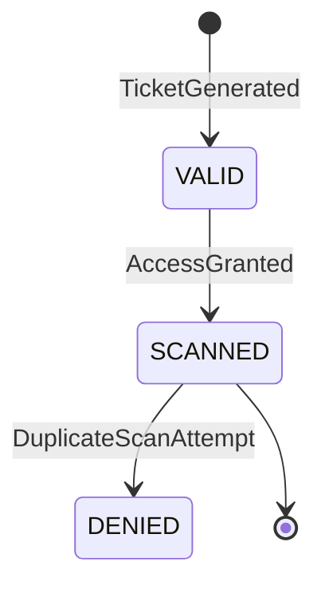
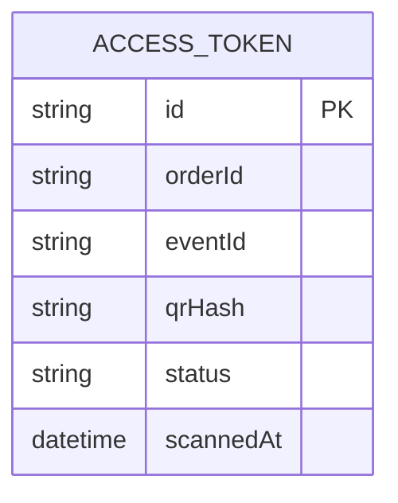
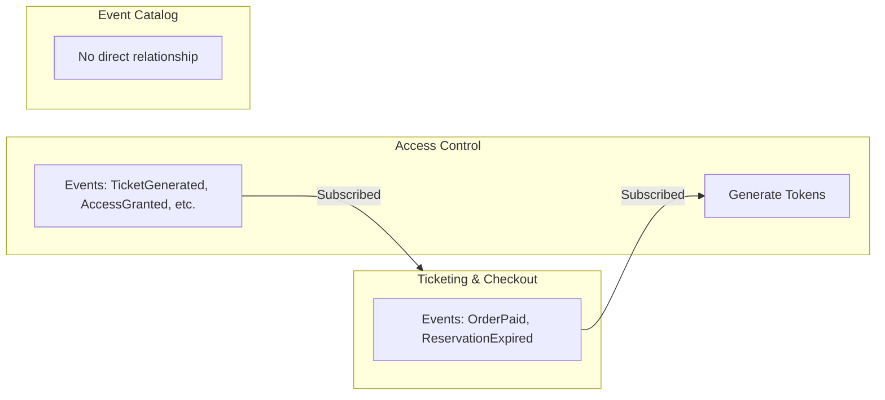
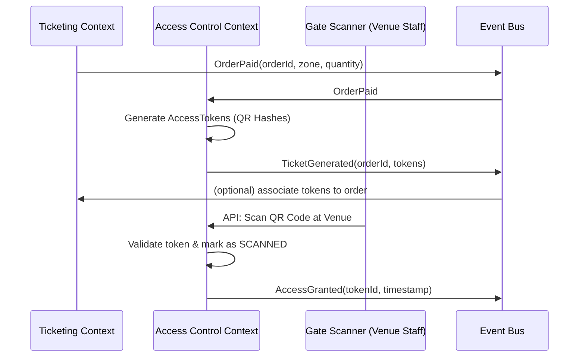

# Bounded Context: Access Control (Gate Operations)

## Table of Contents
- [Description](#description)
- [Responsibilities](#responsibilities)
- [Ubiquitous Language](#ubiquitous-language)
- [Domain Model](#domain-model)
- [Events](#events)
- [Diagrams](#diagrams)

---

## Description
The Access Control context manages how the fan actually gets into the venue. It generates secure QR codes and validates them at the gates. Here, an "order" is irrelevant; it only cares about a cryptographic token that grants entry.

## Responsibilities
- Generate secure, rotating Digital Tickets (QR codes).
- Manage high-speed, offline-capable gate scanning.
- Prevent double-entry fraud.
- Track entry timestamps and states (Valid, Scanned).

## Ubiquitous Language
| Term | Meaning in this context |
| :--- | :--- |
| **Token / QR** | The physical or digital barcode used for entry |
| **Gate** | The physical scanner location at the venue |
| **Scan** | The act of validating a token |

## Domain Model

### Main Entity: AccessToken
A "ticket" in this context is just an entry pass:
```text
AccessToken {
  orderId,
  qrHash,
  zoneName,
  status (VALID, SCANNED),
  scannedAt
}
```

### What this context DOES NOT know
- The price the user paid.
- The marketing description of the concert.
- The user's credit card.

---

## Events

### Emitted Events
| Event | Description | Typical Consumers |
| :--- | :--- | :--- |
| `TicketGenerated` | Secure QR codes created for an order | Ticketing (Update to Delivered) |
| `AccessGranted` | A fan successfully scanned into the venue | Analytics / Reporting |
| `AccessDenied` | A fan attempted to use a duplicate/fake ticket | Security |

### Consumed Events
| Event | Origin | Use in Access Control |
| :--- | :--- | :--- |
| `OrderPaid` | Ticketing | Trigger the generation of the AccessTokens |

---

## Diagrams

### Internal Communication

```mermaid
flowchart TB
    subgraph Access["Context: Access Control"]
        direction TB
        A[Token Generator] --> B[AccessToken Aggregate]
        B --> C[(Token DB - Edge/Fast Read)]
        D[Gate Scanner Service] --> B
        F[Access API] --> D
        G[Event Publisher] --> B
    end
```


### Ticket Lifecycle (States)


### Internal Data Model


### Communication with other bounded contexts

Access Control only reacts to events from Ticketing(OrderPaid) and publishes state events so Ticketing or Analytics can update their views.


### Sequence: from OrderPaid to AccessGranted

## Summary
|Aspect        |Detail                                                                 |
|--------------|-----------------------------------------------------------------------|
|Responsibility|Manage how the fan enters the venue: digital tokens, QR generation, gate scanning|
|Ticket        |Cryptographic pass (orderId + qrHash + zoneName + scan status)         |
|Communication |Consumes OrderPaid; publishes TicketGenerated, AccessGranted, AccessDenied|
|Independence  |Does not know prices, event descriptions, or payment details; only cares about valid entry tokens|

