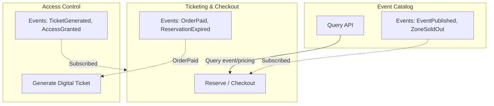
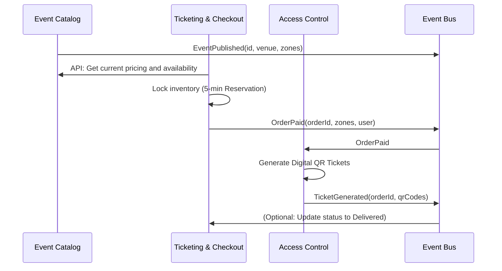

# "EasyPass" Ticketing System - Bounded Contexts

Three bounded contexts communicating via APIs (synchronous) and events (asynchronous) to manage the entire lifecycle of a concert ticket: from discovery, through high traffic purchasing, to scanning at the venue gates.

## Table of Contents

- [Contexts and Documentation](#contexts-and-documentation)
- [Diagram: Context Interaction](#diagram-context-interaction)
  - [Event Flow (Sequence)](#event-flow-sequence)
- [Events by Context](#events-by-context)
- [Summary of Each Context](#summary-of-each-context)

---

## Contexts and Documentation

| Context | Responsibility | Documentation |
| :--- | :--- | :--- |
| **Event Catalog** | Managing the discovery and offering of concerts/tours | [01-event-catalog-context.md](01-event-catalog-context.md) |
| **Ticketing & Checkout** | Managing reservations and financial transactions | [02-ticketing-checkout-context.md](02-ticketing-checkout-context.md) |
| **Access Control** | Managing QR codes and venue entry | [03-access-control-context.md](03-access-control-context.md) |

---

## Diagram: Context Interaction

- **Solid lines**: API (Checkout queries the Catalog for availability and pricing).
- **Dotted lines**: Events (Asynchronous via an Event Bus / SQS / SNS).

### Event Flow (Sequence)

---

## Events by Context

| Context | Emits | Consumes |
| :--- | :--- | :--- |
| **Catalog** | EventPublished, ZoneSoldOut, EventCancelled | OrderPaid, ReservationExpired (to update stock) |
| **Ticketing** | OrderCreated (Reservation), OrderPaid, ReservationExpired | EventPublished |
| **Access** | TicketGenerated, AccessGranted, AccessDenied | OrderPaid |

---

## Summary of Each Context

The core concept ("Ticket" / "User") drastically changes meaning depending on the context. This justifies the division into microservices:

| Concept | Event Catalog | Ticketing & Checkout | Access Control |
| :--- | :--- | :--- | :--- |
| **Ticket** | A price and a zone tier | A financial line item | A cryptographic QR Token |
| **User** | Fan / Browser | Payer / Cardholder | Attendee |
| **Status** | Available / Sold Out | Pending / Paid | Valid / Scanned |