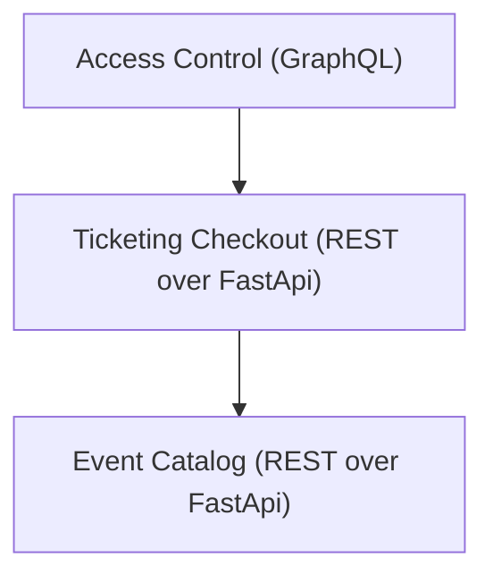

# Ticketing system

- URL del servicio de Catalog: http://localhost:8001/docs
- URL del servicio de Ticketing: http://localhost:8002/docs
- URL del servicio de Access Control: http://localhost:8003/graphql
