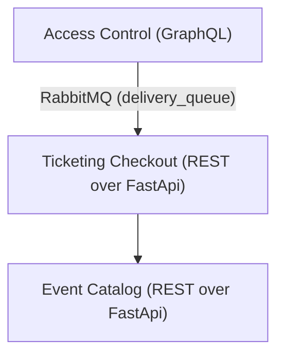

# Ticketing system (Asynchronous Architecture)

- **RabbitMQ Management UI:** http://localhost:15672 (guest/guest)
- **Catalog Service:** http://localhost:8001/docs
- **Ticketing Service:** http://localhost:8002/docs
- **Access Control:** http://localhost:8003/graphql

## How to test the Asynchronous Messaging flow

1. Start the stack: `docker-compose up --build -d`
2. Go to **Ticketing Service** (`http://localhost:8002/docs`) and create an order (POST `/checkout`). Note the `order_id`.
   - *Example Payload:* `{"customer_id": "cust-1", "event_id": "event-001", "zone_name": "VIP Pit", "quantity": 2}`
3. Mark the order as paid (POST `/orders/{order_id}/pay`).
4. Go to **Access Control** (`http://localhost:8003/graphql`) and generate tickets.
   - *Mutation:*
     ```graphql
     mutation {
       generateTickets(orderId: "your-order-id") {
         id
         qrHash
       }
     }
     ```
   - This mutation will publish a JSON message to RabbitMQ's `delivery_queue` instead of making a REST request to Ticketing.
5. Verify the messaging worked:
   - Check the **RabbitMQ Management UI** (`http://localhost:15672`) under the `delivery_queue`. You should see activity (or historical spikes if consumed instantly).
   - Go back to **Ticketing Service** and fetch the order (GET `/orders/{order_id}`). The status should be `DELIVERED` and `delivered_at` should have a timestamp, proving the background RabbitMQ consumer correctly updated the order.
