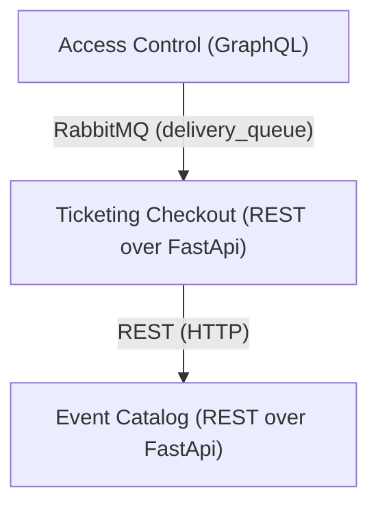

# Homework 4 — Consumer-Driven Contract Testing with Pact

This homework takes the **Homework 3** EasyPass ticketing system (FastAPI REST +
GraphQL services connected through a RabbitMQ asynchronous channel) and adds a
suite of **Pact** contract tests between the clients and the microservices.

The application code is unchanged from Homework 3 except for a small, clearly
marked **test-only** provider-state endpoint added to two services so the Pact
*provider* verifier can put them into a known state (see
[Provider states](#provider-states)).

## System under test



- **RabbitMQ Management UI:** http://localhost:15672 (guest/guest)
- **Catalog Service:** http://localhost:8001/docs
- **Ticketing Service:** http://localhost:8002/docs
- **Access Control:** http://localhost:8003/graphql

## Contracts under test

Pact is *consumer-driven*: each **consumer** records the messages/requests it
relies on, and the **provider** is then verified against that recorded contract.
**Every inter-service path in the system is covered** — both synchronous
(REST/HTTP) channels and the asynchronous RabbitMQ channel:

| # | Consumer       | Provider       | Channel        | Interactions covered                                                                                                                  | Contract file                                   |
| - | -------------- | -------------- | -------------- | ------------------------------------------------------------------------------------------------------------------------------------- | ----------------------------------------------- |
| 1 | Ticketing      | Catalog        | REST (HTTP)    | `GET /events/{id}` (found), `POST /inventory/reservations`, `POST .../confirm`, `POST .../release`, `GET /events/{id}` (404)           | `pact_tests/pacts/ticketing-catalog.json`       |
| 2 | Access Control | Ticketing      | REST (HTTP)    | `GET /orders/{id}` (PAID order), `GET /orders/{id}` (404)                                                                              | `pact_tests/pacts/accesscontrol-ticketing.json` |
| 3 | Ticketing      | Access Control | RabbitMQ (msg) | `delivery_queue` message `{order_id, status: "DELIVERED"}` (a Pact **message** pact)                                                   | `pact_tests/pacts/ticketing-accesscontrol.json` |

These are the real service-to-service interactions from Homework 3:

- **(1)** Ticketing calls Catalog during checkout (fetch event, reserve, then
  confirm on payment / release on expiry).
- **(2)** Access Control calls Ticketing to confirm an order is PAID before
  minting tickets.
- **(3)** Access Control **publishes** a delivery notification onto the RabbitMQ
  `delivery_queue` and Ticketing **consumes** it to mark the order DELIVERED.
  For an async channel the message *consumer* (Ticketing) drives the contract and
  the message *producer* (Access Control) is verified against it — no broker is
  needed for the test.

## How to run the tests

The test flow always has two phases:

1. **Consumer tests** run a Pact mock server and write the contract JSON files
   into `pact_tests/pacts/`. They need **no** running services.
2. **Provider verification** replays each recorded contract against the **live**
   Catalog and Ticketing services and asserts they still honour it.

### Option A — Docker (recommended)

Everything is wired into `docker-compose.yml`. The providers are started with
`PACT_PROVIDER_STATES=true`, and a profile-gated `pact-tests` service runs both
phases in sequence.

```bash
# from the Homework_4_Esteban/ folder

# 1. Build and start the application stack
docker compose up -d --build

# 2. Run the full Pact flow (consumer tests -> provider verification)
docker compose --profile pact run --rm --build pact-tests

# 3. Tear everything down
docker compose --profile pact down -v
```

The `pact-tests` container waits for the providers to be ready, runs the
consumer tests (generating the contracts), then runs the provider verification.
It exits non-zero if any contract is violated, so it works as a CI gate. The
generated contracts are written back to `pact_tests/pacts/` on the host via a
volume mount.

Expected output (abbreviated):

```
STEP 1/2  Consumer tests  (generate the Pact contracts)
8 passed
STEP 2/2  Provider verification  (replay contracts vs live APIs)
3 passed
```

### Option B — Local (Python virtual environment)

Requires Python 3.11+.

> **Windows note:** Pact's bundled Ruby mock server fails if the virtual
> environment lives on a *different drive* than your working directory
> (a Ruby `relative_path_from` bug across drive letters). Create the venv on the
> **same drive** as this repository.

```bash
# from the Homework_4_Esteban/ folder
python -m venv .venv
# Windows:        .venv\Scripts\activate
# macOS / Linux:  source .venv/bin/activate
pip install -r pact_tests/requirements.txt
```

**Phase 1 — consumer tests (no services needed):**

```bash
cd pact_tests
pytest consumer -v
```

**Phase 2 — provider verification (services must be running):**

Start the two providers with the provider-state endpoint enabled. The easiest
way is Docker (`docker compose up -d --build catalog ticketing rabbitmq`), or run
them directly, e.g.:

```bash
# Catalog on :8001
PACT_PROVIDER_STATES=true uvicorn main:app --app-dir catalog --port 8001
# Ticketing on :8002
PACT_PROVIDER_STATES=true uvicorn main:app --app-dir ticketing --port 8002
```

Then verify:

```bash
cd pact_tests
# defaults: CATALOG_BASE_URL=http://localhost:8001, TICKETING_BASE_URL=http://localhost:8002
pytest provider -v
```

## Provider states

Pact uses *provider states* to put a provider into a known condition before each
interaction is replayed. Only when `PACT_PROVIDER_STATES=true`, each provider
exposes a test-only endpoint `POST /_pact/provider_states` (hidden from the
OpenAPI docs) that the verifier calls before every interaction:

- **Catalog** resets its in-memory catalog to the seeded baseline (event
  `event-001` with VIP Pit availability exists; no reservations held). For the
  confirm/release interactions it additionally seeds a RESERVED reservation
  `order-pact-001` when the state mentions a held reservation.
- **Ticketing** seeds a PAID order `order-pact-001` when the state asks for it,
  and otherwise clears all orders.

This endpoint is **not** part of the production API and is never enabled unless
the environment variable is explicitly set.

The **RabbitMQ message** contract (#3) needs no provider-state endpoint: Pact's
`MessageProvider` starts a local proxy, asks a handler for the message Access
Control would publish, and verifies it against the contract.
