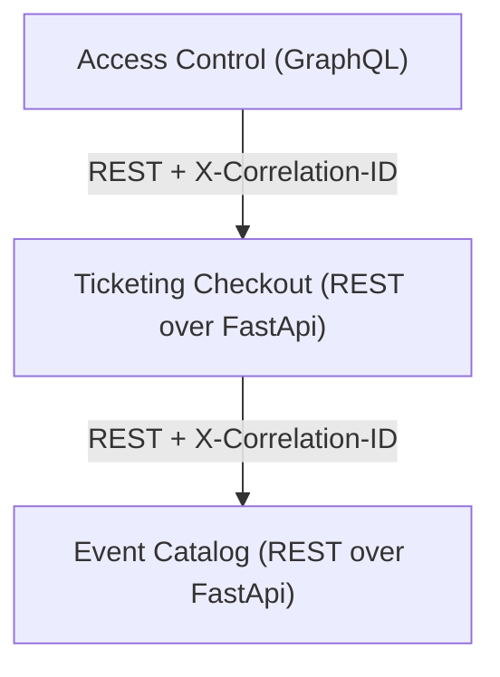

# Homework 5 — Correlation IDs (least-invasive)

This homework takes the **Homework 2** EasyPass ticketing system (three FastAPI
microservices — Catalog & Ticketing over REST, Access Control over GraphQL) and
adds **correlation IDs** that flow across every service, **in the least invasive
way possible**. No business logic (route handlers, GraphQL resolvers, or the
functions that call other services) was modified — the feature is implemented as
a cross-cutting concern (the Python equivalent of AOP) plus HTTP headers.



- **Catalog:** http://localhost:8001/docs
- **Ticketing:** http://localhost:8002/docs
- **Access Control:** http://localhost:8003/graphql

## What a correlation ID is

A correlation ID is a single identifier attached to one logical operation as it
travels through multiple services, so all the log lines it produces — in
Catalog, Ticketing and Access Control — can be tied back together. The header
used here is `X-Correlation-ID`.

## How it works (least-invasive design)

Everything lives in a single drop-in module, `correlation.py` (identical copy in
each service). Each service's `main.py` only gains **three lines** of wiring at
start-up; nothing else changes:

```python
from correlation import (
    CorrelationIdMiddleware, configure_logging, install_requests_propagation,
)
configure_logging()              # every log line carries the correlation ID
install_requests_propagation()   # every outgoing HTTP call carries the header
app.add_middleware(CorrelationIdMiddleware)   # inbound capture + response echo
```

| Concern  | Mechanism | Why it's non-invasive |
| -------- | --------- | --------------------- |
| **Inbound** | A pure **ASGI middleware** reads `X-Correlation-ID` from the request (or generates `gen-<uuid>` if absent), stores it in a `ContextVar`, and echoes it on the response. | Endpoints/resolvers never see it; it wraps the whole app, including `/graphql`. |
| **Outbound** | `requests.Session.request` is **wrapped once** at start-up so every downstream call automatically adds the header from the `ContextVar`. | The existing `requests.get(...)` / `requests.post(...)` call sites are untouched (AOP-style interception). |
| **Logging** | A logging **filter** injects the current correlation ID into every log record. | A single request is traceable across all three services with no per-log changes. |

The `ContextVar` is the key: it is isolated per request and is automatically
copied into FastAPI's threadpool workers, so the value the middleware sets is
visible to the synchronous route handlers and the downstream HTTP calls they
make — without passing anything around explicitly.

## How to run

```bash
# from the Homework_5_Esteban/ folder
docker compose up -d --build

# ...exercise the system (see below)...

docker compose logs            # inspect correlation-aware logs
docker compose down            # tear down
```

Log lines look like this (note the shared `correlation_id`):

```
easypass-ticketing | ticketing      | correlation_id=flow-abc-789 | INFO | inbound POST /checkout
easypass-ticketing | ticketing      | correlation_id=flow-abc-789 | INFO | outbound get http://catalog:8000/events/event-001
easypass-catalog   | catalog        | correlation_id=flow-abc-789 | INFO | inbound GET /events/event-001
```

## How to verify it works

### 1. A client-supplied ID is propagated and echoed

```bash
curl -i -X POST http://localhost:8002/checkout \
  -H "Content-Type: application/json" \
  -H "X-Correlation-ID: demo-trace-123" \
  -d '{"customer_id":"cust-1","event_id":"event-001","zone_name":"VIP Pit","quantity":2}'
```

- The response contains `X-Correlation-ID: demo-trace-123`.
- `docker compose logs | grep demo-trace-123` shows the **same ID** in both
  **ticketing** (inbound `/checkout`, outbound to Catalog) and **catalog**
  (inbound `/events/...` and `/inventory/reservations`).

### 2. A full trace across all three services (REST + GraphQL)

Run a checkout → pay → generate-tickets flow, all with one ID:

```bash
CID=flow-abc-789
# checkout
OID=$(curl -s -X POST http://localhost:8002/checkout -H "Content-Type: application/json" \
      -H "X-Correlation-ID: $CID" \
      -d '{"customer_id":"cust-9","event_id":"event-001","zone_name":"VIP Pit","quantity":1}' \
      | python -c "import sys,json;print(json.load(sys.stdin)['id'])")
# pay
curl -s -X POST "http://localhost:8002/orders/$OID/pay" -H "X-Correlation-ID: $CID" > /dev/null
# generate tickets through the GraphQL service
curl -s -X POST http://localhost:8003/graphql -H "Content-Type: application/json" \
     -H "X-Correlation-ID: $CID" \
     -d "{\"query\":\"mutation { generateTickets(orderId: \\\"$OID\\\") { id qrHash } }\"}"

docker compose logs | grep "$CID"
```

The single ID appears in **access_control** (inbound `/graphql`, outbound to
Ticketing), **ticketing** (inbound + outbound to Catalog), and **catalog**
(inbound) — proving the correlation ID crosses both the REST chain and the
GraphQL service.

### 3. Auto-generation when no header is supplied

```bash
curl -i http://localhost:8002/orders          # no X-Correlation-ID sent
```

The response still carries an `X-Correlation-ID: gen-<uuid>` that the service
generated and used for that request.

> On Windows PowerShell, use `Invoke-WebRequest -UseBasicParsing` with a
> `-Headers @{"X-Correlation-ID"="demo-trace-123"}` hashtable instead of `curl`.

## Files changed vs. Homework 2

- **Added** `correlation.py` to `catalog/`, `ticketing/`, and `access_control/`.
- **`main.py`** in each service: +3 lines of start-up wiring (no logic changes).
- **`docker-compose.yml`**: added a `SERVICE_NAME` env var per service so logs are
  clearly labelled. The Dockerfiles are unchanged — they already `COPY . .`, so
  `correlation.py` is included automatically.
